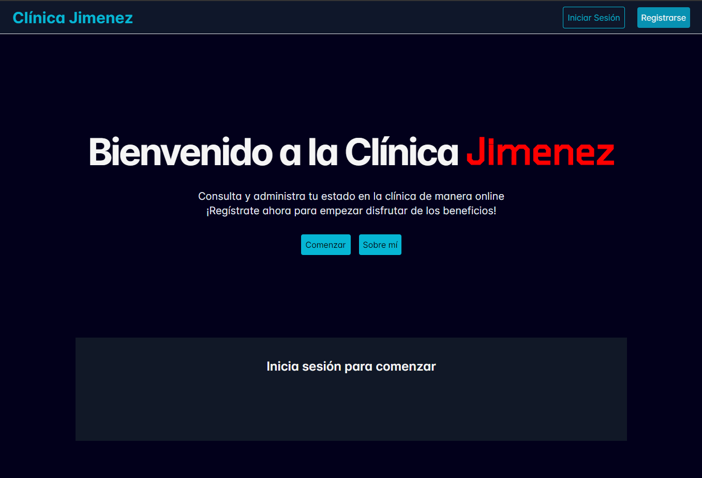
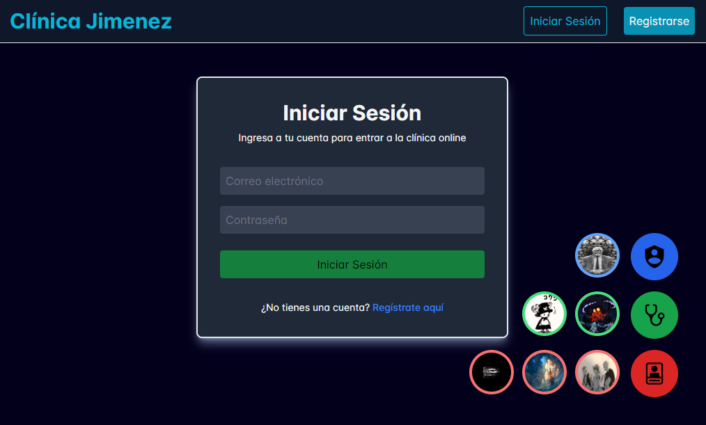
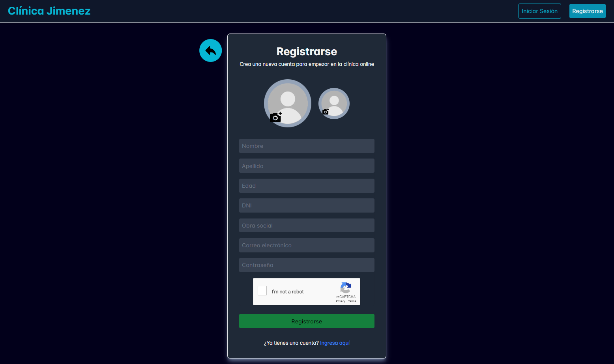
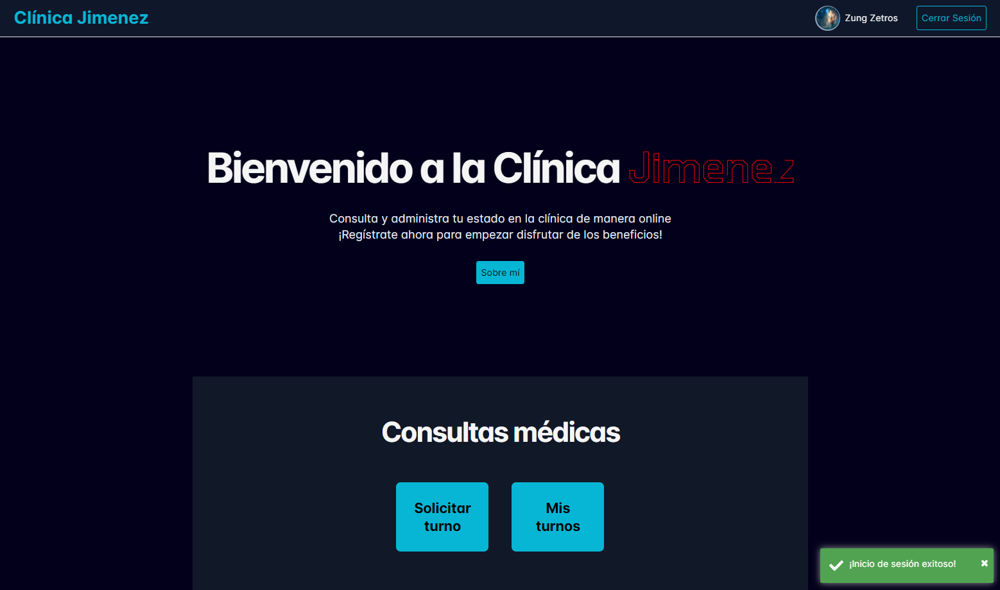
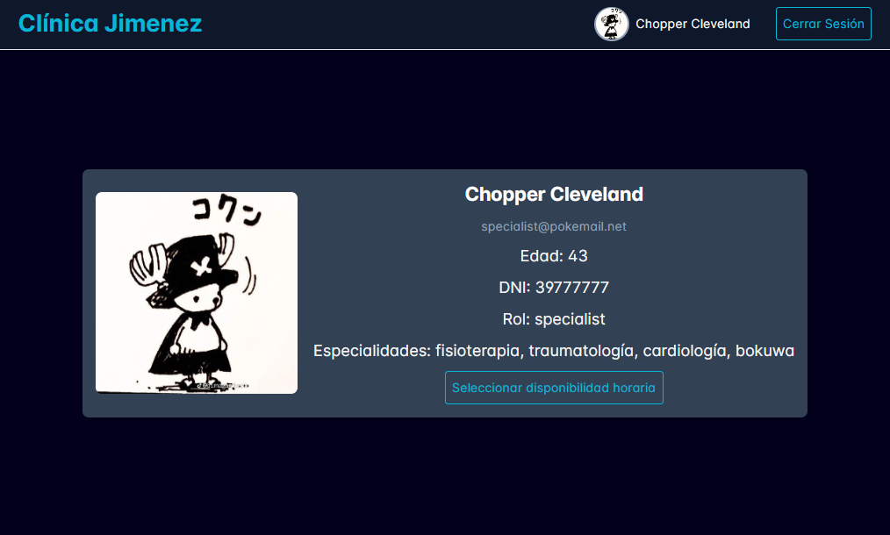
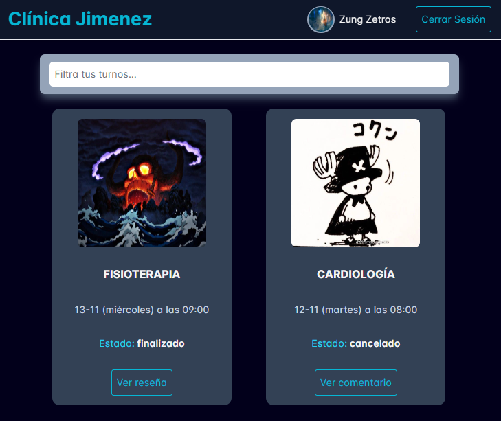
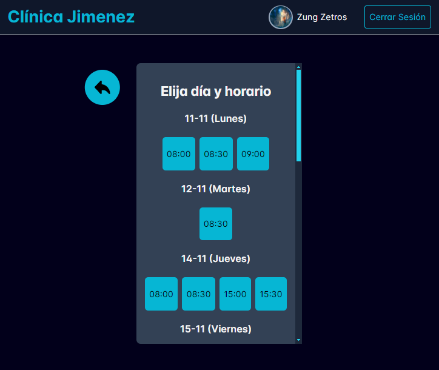
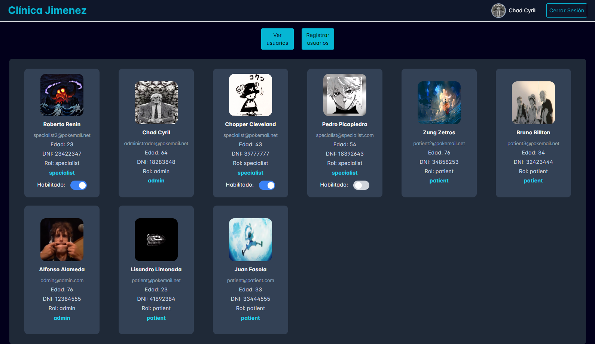

<h1 align="center">Clínica online Jimenez</h1>

<br/>

<h2 align="left">Descripción</h2>
<div align="left">
    <p>
        Aplicación web de una clínica online con el ciclo completo de los turnos, pacientes y gestion de los mismos con distintas pantallas dependiendo del rol que tengas. 
        Cuenta con accesos rápidos para poder probar la app fácilmente
    </p>
    <p>
        Desarrollada como proyecto final de la materia Laboratorio IV de la TUP en la UTN FRA.
    </p>
</div>

## Para usar esta aplicación

#### De forma online:

https://clinica-jimenez.web.app/

#### De forma local:

- Clona este repositorio:

```bash
  git clone https://github.com/francojimenezcopati/Clinica-Jimenez.git
```

- Vé al directorio del proyecto:

```bash
  cd Clinica-Jimenez
```

- Instala las dependencias:

```bash
  npm install
```

- Si no tienes el CLI de Angular:

```bash
  npm install -g @angular/cli
```

- Corre el proyecto:

```bash
  ng serve
```

## 📷 Imágenes de la aplicación

### Bienvenida a usuario anónimo

Tocando 'Comenzar' o 'Registrarse', se nos abre la página de registro. Tocando 'Iniciar sesión', se nos abre la página de inicio de sesión. Tocando 'Sobre mí', se nos abre la página about me, donde cuento quien soy y por qué hice la aplicación web.

<div align="left">
    
</div>

### Inicio de sesión

Abajo a la derecha con FAB buttons estan los accesos rápidos.

<div align="left">
    
</div>

### Registro

Para poder registrarse, todos los campos tienen que ser rellenados y tienen que ser válidos, incluido el reCAPTCHA.

<div align="left">
    
</div>

### Bienvenida a usuario registrado

Si tocamos arriba a la derecha sobre nuestro nombre o sobre nuestra imágen, se nos abre la página de mi perfil. Tocando 'Mis turnos', se nos abre la página para ver todos mis turnos. Tocando 'Solicitar turno', se nos abre la página con el formulario para solicitar un turno.

<div align="left">
    
</div>

### Perfil de usuario

Siendo especialista, se pueden especificar cuales son tus horarios de trabajo para que luego figuren cuando alguien intente sacar un turno con vos.

<div align="left">
    
</div>

### Mis turnos

Aparecen todos mis turnos. Arriba, está el filtro, el cual filtra por especialista y/o por especialidad de los turnos. En cada turno, nos aparecerán botones con la/s accion/es que se pueden hacer, dependiendo del estado en el que se encuentre el turno y del perfil (rol).

<div align="left">
    
</div>

### Solicitar turno

Primero, se elije el especialista con el cual querés el turno, despues, se elije la especialidad de las que tenga ese especialista, y por último, como se ve en la imágen, se elije el horario y el día en el cual querés sacar el turno.

<div align="left">
    
</div>

### Administrar usuarios (admin)

Página solo de administrador. Se pueden ver todos los usuarios, a la vez que se pueden habilitar o deshabilitar cuentas de los especialistas. Tambien, si tocamos 'Registrar usuarios', podremos registrar nuevos usuarios, tanto 'Pacientes', como 'Especialistas' y también otros 'Administradores'.

<div align="left">
    
</div>

## 🔗 Links
<div >
    
[](https://www.linkedin.com/in/francojimenezcopati)
<br/>
[](https://github.com/francojimenezcopati)
<br/>
[](mailto:fjcopati@gmail.com)
<br/>
</div>
